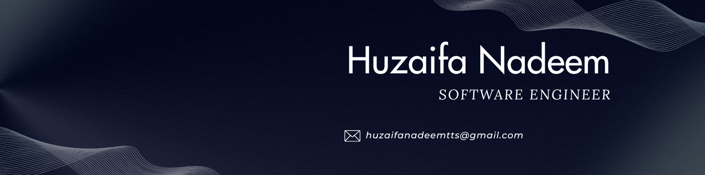

<h1 align="center">Hi 👋, I'm Huzaifa Nadeem</h1>
<h3 align="center">Associate Software Engineer • MERN Stack Developer from Pakistan 🇵🇰</h3>

  
  
  
  

---

## 💫 About Me

Software Engineer with hands-on experience in **full-stack development**, specializing in the **MERN stack** (MongoDB, Express.js, React.js, Node.js). I build responsive web applications, develop and integrate **RESTful APIs**, design **scalable database schemas**, and implement complex, **role-based business logic** — with a proven track record of delivering admin panels, backend services, and production features across multiple live products.

- 🔭 Currently working as **Jr. Software Engineer @ GlowingSoft Technologies**
- 🧠 Deep-diving into **scalable backend architecture** and **role-based access control**
- 💬 Ask me about **React, Next.js, Node.js, Express, MongoDB, Tailwind CSS, MUI**
- 👨‍💻 The repositories here are the **personal projects I started learning with and grew through** — my professional client work lives in private company repositories
- 📫 Reach me at **huzaifanadeemtts@gmail.com**
- 📄 Know about my experience on **[LinkedIn](https://linkedin.com/in/huzaifa-nadeem)**

---

## 💼 Work Experience

**Jr. Software Engineer** — *GlowingSoft Technologies* &nbsp;`May 2026 – Present`
- Developing and maintaining full-stack applications using the MERN stack — responsive interfaces, RESTful APIs, and scalable database-driven features.
- Delivering backend services and admin-panel frontends across multiple concurrent client projects, implementing role-based access control and multi-party business workflows.
- Collaborating with cross-functional teams to design and ship features from requirements through production deployment.

**Web Developer** — *Visionoids Solutions* &nbsp;`Jul 2025 – Dec 2025`
- Developed responsive, user-friendly websites using modern web technologies, ensuring cross-browser compatibility and performance.
- Collaborated with designers and developers, gaining experience in debugging, code optimization, and client-focused delivery.

**Frontend Developer** — *Aasan Hai* &nbsp;`Sep 2024 – Jun 2025`
- Developed responsive, high-performance user interfaces using React and Tailwind CSS.
- Implemented core features and collaborated with cross-functional teams to deliver scalable, maintainable solutions.

---

## 🚀 Key Projects

> These are **professional projects** I built at work — the source lives in private company repositories, so they are not published on this profile. The public repos here are my personal learning projects.

### 🩺 Tempy — Multi-Role Job & Staffing Platform
`MERN Stack` · **Backend Developer**

Backend for a platform connecting customers with suppliers, companies, agencies, and nurses across individual and company-based accounts.

- Designed and implemented **role-based access control** and business logic covering multiple user types and workflows.
- Built complex **job bidding, assignment, acceptance/rejection, and booking workflows**, including customer-to-supplier bidding and nurse-specific direct-booking logic.
- Implemented company/agency assignment flows with reassignment of rejected jobs, and managed relationships between customers, suppliers, agencies, nurses, jobs, bids, and bookings — ensuring bookings are created only after all required approvals.

### 🍼 Nom Nom Babies — Baby Diet & Reminder App
`MERN Stack` · **Full-Stack Developer**

Application helping parents track their babies' diets and receive timely reminders, supporting multiple babies per account.

- Built the **admin panel frontend** and backend services for both the admin panel and the mobile application.
- Implemented **multi-baby account support** and an active-baby switching feature on the home screen.
- Designed application logic so the entire app dynamically adapts based on the currently selected active baby.

### 🔧 Odd Jobs — Service Marketplace App
`React` `Vite` `MUI` `REST APIs` · **Frontend Developer**

Marketplace connecting users with service professionals such as plumbers, electricians, and painters.

- Built the admin panel frontend with **responsive, reusable UI components** using React, Vite, and MUI.
- Integrated REST APIs and implemented admin features for managing users, service providers, and application data.

---

## 💻 Tech Stack

**Frontend**

         

**Backend**

    

**Database**

 

**Tools & Practices**

    

---

## 🎓 Education

| Degree | Institute | Duration | Result |
| :--- | :--- | :--- | :--- |
| Bachelor of Software Engineering | Riphah International University | 2022 – 2026 | CGPA **3.4** |
| Intermediate (ICS) | Govt. Graduate College | 2019 – 2021 | 648/1100 (**58.9%**) |
| Matriculation | Al Ain Public School | 2016 – 2018 | 717/1100 (**65.18%**) |

---

## 🌍 Languages

`English — Fluent` &nbsp;•&nbsp; `Urdu — Native`

---

## 📊 GitHub Stats

  

  

  
  

  
  

## 🏆 GitHub Trophies

  

---

  <i>Open to collaboration on MERN stack projects — feel free to reach out! 🚀</i>

